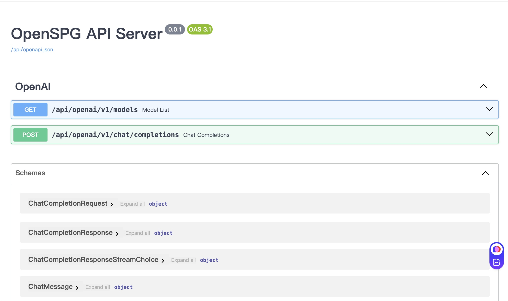

# OpenSPG Solver API in OpenAI Style

An OpenAI style API for OpenSPG Solver.

<div align="center">
    
</div>

## Environment

- Python 3.8+
- [KAG 0.7](https://github.com/OpenSPG/KAG)

## Install

- Clone the repository

```shell
git clone https://github.com/thundax-lyp/openspg-solver-api.git
cd openspg-solver-api
```

- Create Conda Environment

```shell
conda create -n openspg-solver-api python=3.8
conda activate openspg-solver-api
```

- Install requirements

```shell
pip install -r requirements.txt
```

- Run API Server

```shell
python api.py --host=0.0.0.0 --port=8888 --openspg-service=http://127.0.0.1:8887
```

## Command Line Options

- `--host`: Host to bind the server (default: 127.0.0.1)
- `--port`: Port to bind the server (default: 8888)
- `--servlet`: Base path for API endpoints (default: /api)
- `--desc`: API description (default: OpenSPG API Server)
- `--openspg-service`: URL of the OpenSPG service (default: http://127.0.0.1:8887)
- `--openspg-modules`: Additional modules to load (optional)

## LLM Configuration

Before using the chat completions API, you need to configure an LLM in your OpenSPG project:

```yaml
# Define LLM client
generate_llm: &generate_llm
  api_key: your_api_key_here
  base_url: https://api.openai.com/v1
  model: gpt-3.5-turbo
  type: stream_openai_llm
  temperature: 0.7

# Configure solver pipeline
solver_pipeline:
  generator:
    type: default_generator
    llm_client: *generate_llm
```

See [LLM Configuration Guide](./app/openspg/service/kag_additions/README.md) for more details.

## API Documentation

API documentation is available at:

```
http://your-server:port/api/docs
```

## API Endpoints

### Configuration Validation

```shell
curl -X 'POST' \
  'http://127.0.0.1:8888/api/validate_config' \
  -H 'accept: application/json' \
  -H 'Content-Type: application/json' \
  -d '{
  "project_name": "YourProjectName"
}'
```

### Models List

```shell
curl -X 'GET' \
  'http://127.0.0.1:8888/api/openspg/v1/models' \
  -H 'accept: application/json'
```

Response:

```json
{
  "object": "list",
  "data": [
    {
      "id": "openspg/TwoWiki",
      "object": "model",
      "created": 1742525286,
      "owned_by": "owner"
    },
    {
      "id": "openspg/BaiKe",
      "object": "model",
      "created": 1742525286,
      "owned_by": "owner"
    }
  ]
}
```

### Chat Completions

```shell
curl -X 'POST' \
  'http://127.0.0.1:8888/api/openspg/v1/chat/completions' \
  -H 'accept: application/json' \
  -H 'Content-Type: application/json' \
  -H 'Authorization: Bearer none' \
  -d '{
  "model": "openspg/BaiKe",
  "messages": [
    {
      "role": "user",
      "content": "周杰伦曾经为哪些自己出演的电影创作主题曲？"
    }
  ]
}'
```

## Troubleshooting

### Common Issues

1. **Connection reset during streaming**
   - Increase the client timeout settings
   - Make sure you're properly consuming the stream

2. **JSON serialization errors**
   - Check your project for non-serializable objects in responses

3. **LLM configuration errors**
   - Validate your configuration using the `/api/validate_config` endpoint
   - Check the required fields for your chosen LLM type

### Debug Logging

Enable detailed logging by setting the environment variable:

```shell
export LOG_LEVEL=DEBUG
```

## Contributors

- Original author: thundax-lyp
- Contributors welcome!
